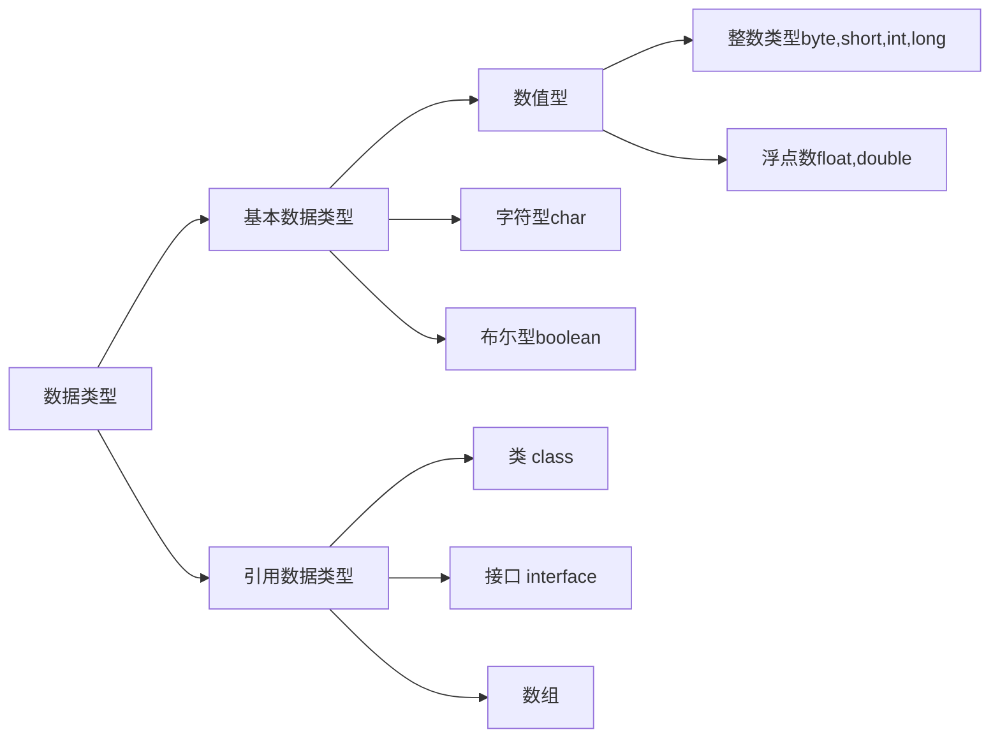

#  java02

#### 关键字

---


```java
/*
关键字：被Java语言赋予特定含义的单词

特点：组成关键字的字母全是小写

注意：
	A:goto和const是保留字
*/
class KeyWorldDemo {
	public static void main(String[] args) {
		System.out.println("HelloWorld");	
	}
}
```

- 用于定义数据类型的关键字
  - class 、interface、byte、short、int、long、float、double、char、booleen、void

- 用于定义数据类型值的关键字
  - true、false、null

- 用于定义流程制的关键字
  - if、else、switch、case、default、while、do、for、break、continue、return 

- 用于定义访问权限的
  - private、protected、public

- 用于定义类、函数、变量修饰的关键字
  - abstract、final、static、synchronized

- 用于定义类与类之间的关系
  - extends、importments

- 用于建立实例、引用实例、判断实例的关键字
  - new、this、super、instanceof

- 用于导常处理的关键字
  - try、catch、finally、throw、throws

- 用于包的关键字
  - package、import

- 其他修饰符关键字
  - native、strictfp、transient、volatile、assert

#### 标识符

---

- 定义：就是给类、接口、方法、变量等起名字的时候用的字符序列
- 组成规则
  - 英文大小写字母
  - 数字字符
  - $和_

- 注意事项
  - 不能与数字开关
  - 不能是Java中的关键字
  - 区分大小写

- 常见的命名规则
  - 见名知意例如 ：Student
    - 包：其实就是文件夹 全部小写
      - 单级包：brbg
      - 多级包：cn.brbg
    - 类或接口
      - 一个单词：单词的首字母必须大写：Dog
      - 多个单词：每个单词的首字母必须大写：HelloWorld，StudentName
    - 方法或变量
      - 一个单词：单词首字母小写
      - 多个单词：从第二个单词开始，每个单词的首字母大写：studentAge、showAllName
    - 常量 :
      - 一个单词：全部大写：PI
      - 多个单词：每个字母都大写，用_隔开：STUDENT_MAX_AGE

```java
class MakeNameDemo {
	public static void main(String[] args) {
		int x = 1000;
	}
}
```

#### 注释

---

- 解释说明程序的文字
- 注释的分类格式
  - 单行注释
    - //
  - 多行注释
    - /*  */
  - 文档注释
    - /***   */

- 注释的作用
  - 解析说明程序，提高程序的阅读性
  - 帮助我们高度程序

```java
/*
	注释：用于解释说明程序的文字
	
	Java中注释的分类及格式
		单行注释： //
		多行注释： /星   星/
			注意：多行不可以嵌套使用，而单行是可以的
			文档注释：被Javadoc工具解析生成一人说明书，面向对象部分讲解。
		
		
*/

//这是我的注释案例

class ZhuShiDemo {
	public static void main(String[] args) {
		System.out.println("半人半鬼");
	}
}
```

```java 
/*
	需求：我准备写一个java程序，把"HelloWorld"这句话输出在控制台
	
	分析：
		A:要写一个Java程序，必须定义类
		B:把数据能够输出，说明我们的程序是可以独立运行的，而程序要独立运行，必须定义main方法
		C:把数据输出在控制台，必须使用输出语句
		
	实现：
		A:java语言提供了一个关键字：class用来定义类，后面跟的是类名
		B:main方法的格式是固定的：
			public static void main(String[] args) {
			
			}
		C:输出语句的格式是固定的：
			System.out.println("HelloWorld");
			"HelloWorld"这个内容是可以改变的
*/

//这是我的HelloWorld案例
class HelloWorld {
	/*
		为了程序能够独立运行，定义main方法
		main方法是程序的入口
		被jvm自动调用
	*/
	public static void main(String[] args) {
		//为了把数据显示在控制台，我们就使用了输出语句
		System.out.println("HelloWorld");
	}
}
```

#### 常量

---

- 在程序执行过程中其值不可以改变
- 分类
  - 字面值常量 
  - 自定义常量 

 ```java
/*
	常量：
		在程序执行过程中，其值不发生改变的量。
		
	分类：
		A:字面值常量
		B:自定义常量(后面讲)
		
	字面值常量
		A:字符串常量	用双引号括起来的内容。
			举例："hello","world","HelloWorld"
		B:整数常量	所有的整数
			举例：100,200
		C:小数常量	所有的小数
			举例：10.23,110.11
		D:字符常量	用单引号括起来的内容
			举例：'a','A','0'
			错误的：'ab'
		E:布尔常量	比较特殊
			举例：true,false
		F:空常量	后面讲
			举例：null
*/
class ConstantDemo {
	public static void main(String[] args) {
		//字符串常量的输出
		System.out.println("hello");
		
		//整数常量的输出
		System.out.println(100);
		
		//小数常量的输出
		System.out.println(100.10);
		
		//字符常量的输出
		System.out.println('a');
		System.out.println('A');
		System.out.println('0');
		//这个是有问题的
		//System.out.println('ab');
		
		//布尔常量的输出
		System.out.println(true);
		System.out.println(false);
	}
}

 ```

- 进制：是一种进位的方式。X进制是逢X进1.
- 计算机的电子原件的状态：
  - 开
  - 关

- 我们表达数据的时候也是按照开和关的状态来表示的。如果我们表达数据仅仅用这俩种状态，那么能够表达的数据是比较少的，而我们常见的数据：英文、数字、标点符号、这就很多了，俩个状态是肯定不够的，为了能够表示更多 的数据，国际化标准组织就规定，用8个这个的信号来表示一个数据，这个数据的单位叫**字节**。后来我们就用数字**1**和**0** 来表示开和关。由这样1和0组成的数据叫做**二进制**

- 但是由这样的直进制表达数据的表现形式有点长，所以，我们就简化一下。

  - 八进制
    - 把二进制的数据，从右开始。每**三位**一组合，最左边不够的时候，补0，然后分别计算出相对应的十进制数值。最后，在把每个十进制组合起来就是一个**八进制**数据。

  ```mermaid
  graph TD
  F[10110110]
  A[010]-->|十进制|AA[2]
  B[110]-->|十进制|BB[6]
  C[110]-->|十进制|CC[6]
  AA-->|组合|D[266]
  BB-->|组合|D
  CC-->|组合|D
  
  
  
  ```

  

  - 十六进制
    - 把二进制的数据从右开始，每**四位**一组，最左边不够补0，然后分别计算出对应的十进制数据，最后在把每个十进制的数值组合起来就是一个**十六进制**数据

  ```mermaid
  graph TD
  F[10110110]
  A[1011]-->|十进制|AA[11]
  B[0110]-->|十进制|BB[6]
  AA-->|组合|D[b6]
  BB-->|组合|D
  ```

  

```java
/*
	不同进制的数据表现：
		二进制：由0，1组成。以0b开头。
		八进制：由0,1,...7组成。以0开头。
		十进制：由0,1,...9组成。默认整数是十进制。
		十六进制：由0,1,...9,a,b,c,d,e,f(大小写均可)组成。以0x开头。
*/
class JinZhiDemo {
	public static void main(String[] args) {
		System.out.println(100); //十进制
		
		System.out.println(0b100); //二进制
		System.out.println(0100); //八进制
		System.out.println(0x100); //十六进制
	}
}
```

- #### 进制的转换

  - 其它进制到十进制

```java
十进制到十进制
123 = 100 + 20 + 3
    = 1X10^2 + 2X10^1 + 3X10^0
    =100 + 20 + 3
    123

系数：每一个们上的数据本身就是位数。
基数：x进制的基数就是x。
权：我们对每一个位上的数据编号，从右到左，并且是从0 开始编号，这个编号就是该位上的公值。
   
每一个位上的系数+基数^权次幂相加
    
二进制--->十进制
100 = 1X2^2 + 0X2^1 + 0X2^0
    = 4 + 0 + 0
    =4
    
八进制--->10进制
100 = 1X8^2 + 0X8^1 + 0X8^0
    = 64 + 0 + 0
    = 64
    
十六进制--->十进制
100 = 1X16^2 + 0 + 0
    =256
```

| 十进制 |  商  | 余数 | 十进制 |
| :----: | :--: | :--: | :----: |
|   10   | 123  |      |  123   |
|   10   |  12  |  3   |        |
|   10   |  1   |  2   |        |
|   10   |  0   |  1   |        |
|        |      |      |        |

- 除基取余，直到商为0，余数反转。

| 十进制 |  商  | 余数 | 二进制 |
| :----: | :--: | :--: | :----: |
|   2    |  6   |      |  110   |
|   2    |  3   |  0   |        |
|   2    |  1   |  1   |        |
|   2    |  0   |  1   |        |

- 8421码是BCD码中的一种
  - 每一个二进制位上的数据对应一个固定的值，只需要把对应位上的数据值相加。即可得到该二进制对应十进制的值。

|  1   |  1   |  1   |  1   |  1   |  1   |  1   |  1   | 11111111 |
| :--: | :--: | :--: | :--: | :--: | :--: | :--: | :--: | :------: |
| 128  |  64  |  32  |  16  |  8   |  4   |  2   |  1   |   255    |

- 任意进制的转换
  - 先转成十进制
  - 再转成目标进制

#### 有符号的数据表示法

---

- 在计算机内有符号数有3种表示法：
  - 原码
    - 就是二进制定点表示法：即最高位为符号位，**0表示正数，1表示负数**，其余位表示数值大小
  - 反码
    - 正数的反码与其原码相同
    - 负数的反码是对其原码逐位取反，但**符号位除外**。
  - 补码
    - 正数的补码与其原码相同
    - 负数的补码是在其反码的**末位加1** 

- 所有数据的运算都是采用二进制的补码来进行的。

| 原码 | 符号位 | 数值位  |
| :--: | :----: | :-----: |
|  +7  |   0    | 0000111 |
|  -7  |   1    | 0000111 |

| 反码 | 符号位 | 数值位  |
| :--: | :----: | :-----: |
|  +7  |   0    | 0000111 |
|  -7  |   1    | 1111000 |

| 补码 | 符号位 | 数值位  |
| :--: | :----: | :-----: |
|  +7  |   0    | 0000111 |
|  -7  |   1    | 1111001 |

#### 变量

---

- 在程序的执行过程中，在某个范围内其值发生改变的量
- 就是的定义格式
  - 数据类型    变量名  =  初始值  ;
  - 注意：格式是固定的，死记格式，以不变应万变。
  - 我们在运算的时候不可能拿着这个空间云运算，我们真正运算的时候是拿着空间中的值，我们就给该空间起了一个名字。就是**变量名=该空间的名字**，
  - 我们还要对其空间做限定，**用数据类型来限定空间的类型**
  - 即使用有空间类型，变量名，但是空间没有值，还是没有太大的意义。**初始化值**。

- 使用变量的注意事项

  - 作用域 
    - 变量定义在哪一级大括号中，哪个大括号的范围就是变量的作用域，相同的作用域不能定义两个同名的变量。

  - 初始化值
    - 没有初始化值的变量不能直接使用。

  - 在一行上建议只定义一个变量
    - 可以定义多个，但是不建议这么干。

```java
/*
	使用变量的时候要注意的问题：
		A:作用域
			变量定义在哪个大括号内，它就在这个大括号内有效。
			并且，在同一个大括号内不能同时定义同名的变量。
			
		B:初始化值
			没有初始化值的变量不能直接使用。
			你只要在使用前给值就行，不一定非要在定义的时候立即给值。
			推荐在定义的时候给值。
			
			定义变量的格式：
				a:数据类型 变量名 = 初始化值;
				b:数据类型 变量名;
				  变量名 = 初始化值;
		
		C:在一行上建议只定义一个变量
			可以定义多个，但是不建议
*/
class DataTypeDemo2 {
	public static void main(String[] args) {
		//定义变量
		int x = 100;
		
		//错误，不能有同名的
		//int x = 200;
		
		//定义变量必须给值
		//int y;
		//System.out.println(y);
		
		int z;
		z = 100;
		System.out.println(z);
		
		//在一行上定义多个变量
		//int a = 10; int b = 20; int c  = 30;
		//上面的写法可以，但是不建议。
		int a = 10; 
		int b = 20; 
		int c  = 30;
		
		//int d, e;
		//d = 40;
		//e = 50;
		
		//int f,int g; //错误
		//int h; int i; //正确
	}
}
```


####  数据类型

---

- Java是强类型语言，对于每一种数据都定义了明确的具体数据类型，在内存总分配不同大小的内存空间。




```java
/*
	数据类型：Java是一种强类型的语言，针对每一种数据都定义了明确的数据类型。
	
	数据类型分类：
		A:基本数据类型
		B:引用数据类型(类,接口,数值)
		
	基本数据类型:4类8种
		A:整数			占用字节数
			byte			1
			short			2
			int				4
			long			8
			
		B:浮点数
			float 			4
			double 			8
			
		C:字符
			char			2
		D:布尔
			boolean			1
		
		注意：
			整数默认是int类型
			浮点数默认是double类型。
			
			长整型后缀用L或者l标记。建议使用L。
			单精度浮点数用F或者f标记。建议使用F。
*/
class DataTypeDemo {
	public static void main(String[] args) {
		//定义变量的格式：
		//数据类型 变量名 = 初始化值;
		
		//定义一个字节变量
		byte b = 10;
		System.out.println(10);
		System.out.println(b);
		
		//定义一个短整型变量
		short s = 100;
		System.out.println(s);
		
		//定义一个整型变量
		int i = 1000;
		System.out.println(i);
		
		//超过了int的范围
		//int j = 1000000000000;
		long j = 1000000000000L;
		//long j = 100L;
		System.out.println(j);
		
		//定义浮点数据变量
		float f = 12.345F;
		System.out.println(f);
		
		double d = 12.345;
		System.out.println(d);
		
		//定义字符变量
		char ch = 'a';
		System.out.println(ch);
		
		//定义布尔变量
		boolean flag = true;
		System.out.println(flag);
	}
}
```

- **+**是一个运算符，做数据的加法
- boolean类型的能转换为其他的数据类型
- 默认转换
  - byte.short.char--int--long--float--double
  - byte.short.char相互之间不转换，他们参与运算首先转换为int类型

- 强制转换
  - 目标类型 变量名=（目标类型）（被转换的数据）;

```java 
/*
	+是一个运算符(我们等会讲解)。做加法运算的。
	
	一般来说，我们在运算的时候，要求参与运算的数据类型必须一致。
	
	注意：
		boolean类型不能转换为其他的数据类型

	默认转换(从小到大的转换)
		A:byte,short,char—int—long—float—double
		B:byte,short,char相互之间不转换，他们参与运算首先转换为int类型
*/
class DataTypeDemo3 {
	public static void main(String[] args) {
		//直接输出的方式做加法
		//System.out.println(3 + 4);
	
		//两个int类型做加法
		int x = 3;
		int y = 4;
		int z = x + y;
		System.out.println(z);
		
		//定义一个byte类型，一个int类型，做加法
		byte a = 3;
		int b = 4;
		System.out.println(a + b);
		
		//可能损失精度
		//byte c =  a + b;
		int c = a + b;
		System.out.println(c);
	}
}
```

```java
/*
	强制转换：
		从大的数据类型到小的数据类型。
		
		格式：
			目标数据类型 变量 = (目标数据类型) (被转换的数据);
			
		注意：
			不要随意的去使用强制转换，因为它隐含了精度损失问题。
*/
class DataTypeDemo4 {
	public static void main(String[] args) {
		byte a = 3;
		int b = 4;
		
		//这个肯定没有问题
		//int c = a + b;
		
		//byte c = 7;
		//这个是有问题的
		//byte c = a + b; 
		//用强制类型转换改进
		byte c = (byte) (a + b);
		System.out.println(c);
	}
}
```

```java 
/*
	思考题1：请问下面这个有没有问题
		double d = 12.345;
		float f = d;
		
	思考题2：看看下面两个定义有没有区别呢?
		float f1 = (float)12.345;
		float f2 = 12.345f;
		
		f1其实是通过一个double类型转换过来的。
		而f2本身就是一个float类型。
*/
class DataTypeDemo5 {
	public static void main(String[] args) {
		//把double赋值给float，加了强制类型转换
		double d = 12.345;
		float f = (float)d;
		
		//看看下面两个定义有没有区别呢?
		float f1 = (float)12.345;
		float f2 = 12.345F;
	}
}
```

```java
/*
	面试题：
		byte b1=3,b2=4,b;
		b=b1+b2;
		b=3+4;
		哪句是编译失败的呢？为什么呢？
		b = b1 + b2;是有问题的。
		因为变量相加，会首先看类型问题，最终把结果赋值的也会考虑类型问题。
		常量相加，首先做加法，然后看结果是否在赋值的数据类型范围内，如果不是，才报错。
*/
class DataTypeDemo6 {
	public static void main(String[] args) {
		//定义了三个byte类型的变量，b1，b2，b3
		//b1的值是3，b2的值是4，b没有值
		byte b1 = 3,b2 = 4,b;
		
		//b = b1 + b2; //这个是类型提升，所有有问题
		
		b = 3 + 4; //常量，先把结果计算出来，然后看是否在byte的范围内，如果在就不报错。
	}
}
```

```java
/*
	byte b = 130;有没有问题?如果我想让赋值正确，可以怎么做?结果是多少呢?
	
	练习：byte b = (byte)300;
*/
class DataTypeDemo7 {
	public static void main(String[] args) {
		//因为byte的范围是：-128到127。
		//而130不在此范围内，所以报错。
		//byte b = 130; 
		
		//我们可以使用强制类型转换
		byte b = (byte) 130;
		
		//结果是多少呢?
		System.out.println(b);
	}
}
/*
	分析过程：
		我们要想知道结果是什么，就应该知道是如何进行计算的。
		而我们又知道计算机中数据的运算都是补码进行的。
		而要得到补码，首先要计算出数据的二进制。
		
		A:获取130这个数据的二进制。
			00000000 00000000 00000000 10000010
			这是130的原码，也是反码，还是补码。
		B:做截取操作，截成byte类型的了。
			10000010 
			这个结果是补码。
		C:已知补码求原码。
					符号位		数值位
			补码：	1			0000010
			
			反码：	1			0000001
			
			原码：	1			1111110
*/

```

```java
/*
	看程序写结果
	
	通过字符和一个整数相加，我们给出一张表：ASCII码表。
		通过看完这张表以后，我们要记住三个值：
			'a'		97
			'A'		65
			'0'		48
*/
class DataTypeDemo8 {
	public static void main(String[] args) {
		//直接输出一个字符
		System.out.println('a'); //a
		//输出一个字符和一个整数做加法
		System.out.println('a'+1); //98
	}
}
```

```java
/*
	看程序写结果
		字符串数据和其他数据做+，结果是字符串类型。
		这里的+不是加法运算，而是字符串连接符。
*/
class DataTypeDemo9 {
	public static void main(String[] args) {
		System.out.println("hello"+'a'+1); //helloa1
		System.out.println('a'+1+"hello"); //98hello
		
		System.out.println("5+5="+5+5); //5+5=55
		System.out.println(5+5+"=5+5"); //10=5+5
	}
}
```

